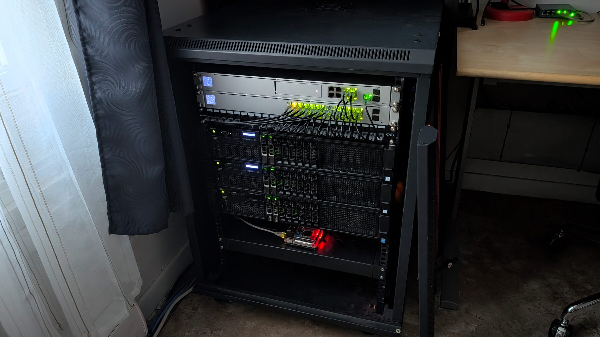
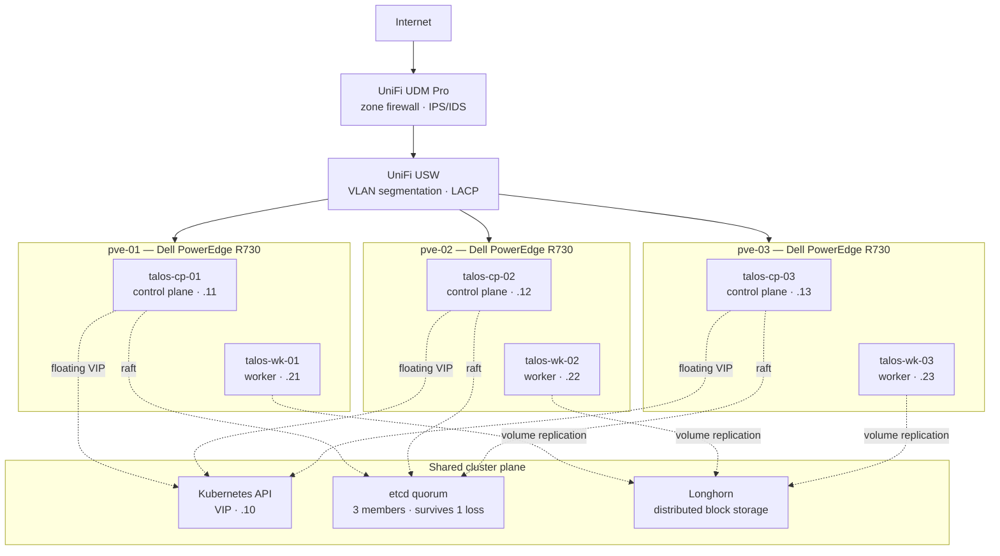
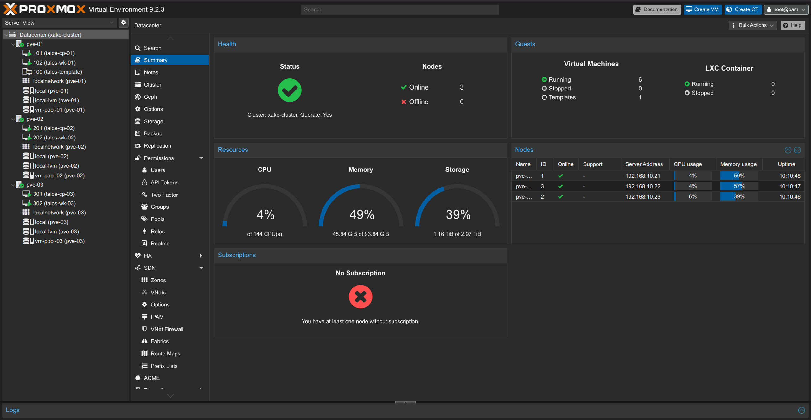
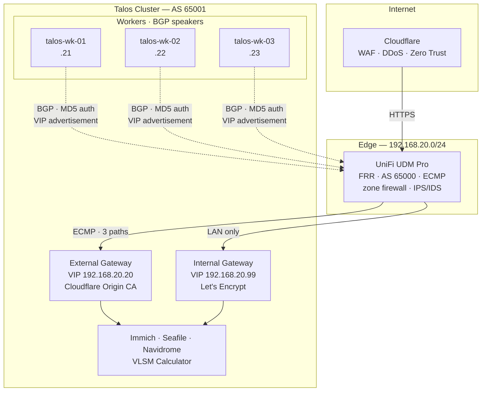
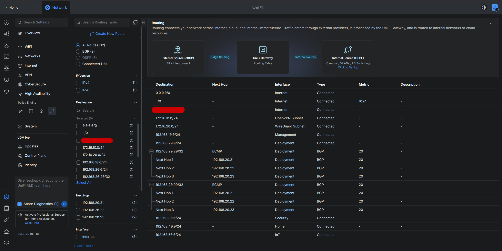
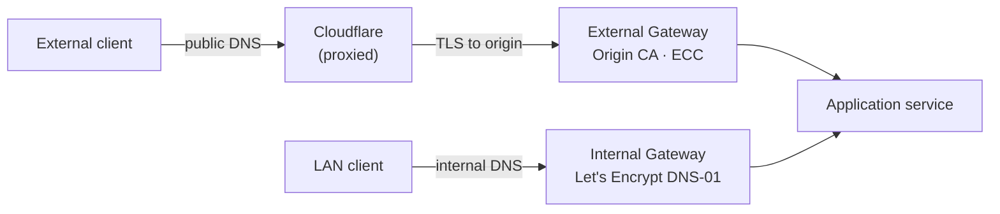
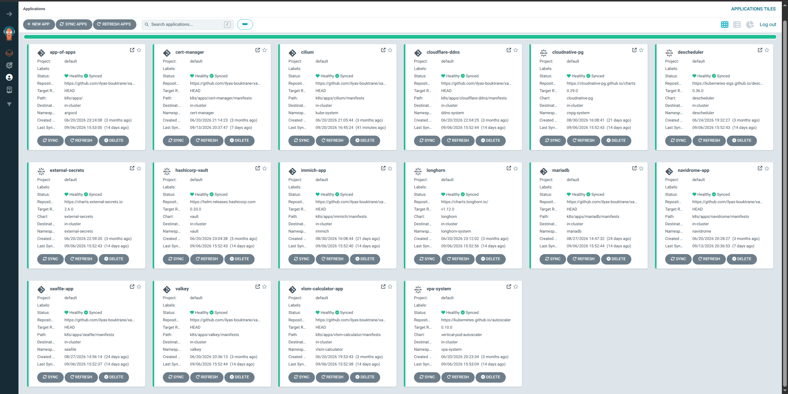
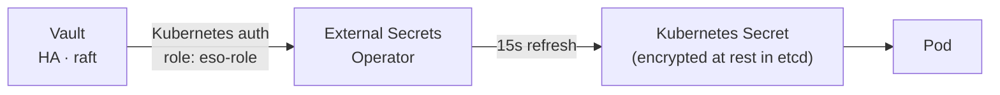
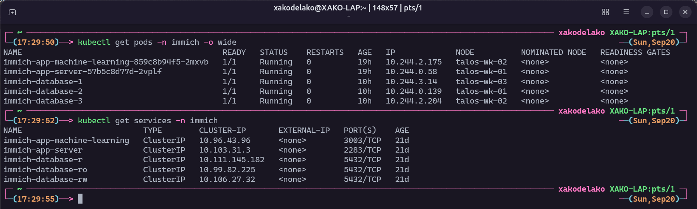

# 🏗️ Production Distributed Kubernetes Datacenter

<div align="center">

[](https://kubernetes.io/)
[](https://www.talos.dev/)
[](https://www.proxmox.com/)
[](https://helm.sh/)
[](https://cilium.io/)
[](https://frrouting.org/)
[](https://ui.com/)
[](https://www.cloudflare.com/)
[](https://argo-cd.readthedocs.io/)
[](https://longhorn.io/)
[](https://www.vaultproject.io/)

</div>

A production-grade, distributed Kubernetes datacenter architected from scratch — every component sourced individually — and deployed in a real 15U rack. Three Dell PowerEdge R730 hosts run Proxmox VE with Talos Linux in a redundant **3+3 topology**: one control-plane VM and one worker VM per physical host.

**This repository is the single source of truth.** Once the cluster is bootstrapped, a `git push` to `main` is the only deployment mechanism — no workload is ever deployed or changed with a manual `kubectl apply`.

🌐 **Live services:** [gallery.xako.net](https://gallery.xako.net) · [drive.xako.net](https://drive.xako.net) · [music.xako.net](https://music.xako.net) · [vlsm.xako.net](https://vlsm.xako.net)

---

## 📸 The Rack



---

## 🚀 About The Project

Every personal service I use — photo backup, file sync, music streaming, custom applications — runs on hardware I own, with **zero dependency on third-party service providers**. The only external pieces are the ones the edge itself relies on: DNS, DDoS protection and TLS issuance through Cloudflare and Let's Encrypt. That constraint drove every architectural decision in this repository.

The goal was not to make self-hosting work. It was to make it work the way production infrastructure works: declarative, reproducible, observable, and recoverable without a human typing commands into a terminal.

Four decisions define the build:

- 🧩 **Talos Linux** — an immutable, API-driven OS with no shell and no SSH. The attack surface of a node is its API, and nothing else.
- 🛰️ **BGP-routed VIPs instead of L2 announcements** — Cilium peers with the UniFi gateway so LoadBalancer VIPs are genuinely routed with ECMP, not owned by a single elected node.
- 🔀 **Split-horizon DNS with dual certificate authorities** — one hostname, two paths, and a publicly trusted certificate presented to every client.
- 🔐 **No secrets in Git, ever** — Vault HA + External Secrets Operator, verifiable across the entire commit history.

---

## 🖥️ Hardware & Edge

| Layer                   | Equipment                                                           |
| ----------------------- | ------------------------------------------------------------------- |
| **Rack**                | 15U, self-assembled                                                 |
| **Compute**             | 3 × Dell PowerEdge R730 running **Proxmox VE** in a quorate cluster |
| **Aggregate resources** | 144 CPU threads · 94 GiB RAM · 3 TiB storage                        |
| **Kubernetes nodes**    | 6 × **Talos Linux** VMs — 1 control plane + 1 worker per host       |
| **Gateway**             | **UniFi UDM Pro** — zone-based firewall, IPS/IDS, FRRouting         |
| **Switching**           | **UniFi USW** — VLAN segmentation, LACP link aggregation, PoE       |
| **Edge**                | **Cloudflare** — WAF, DDoS protection, proxied DNS, Zero Trust      |
| **Remote access**       | OpenVPN and WireGuard, each on its own routed subnet                |

### Network segmentation

Seven segments, separated by function rather than convenience, with zone-based firewall policies between them:

| Segment                             | Purpose                                                                 |
| ----------------------------------- | ----------------------------------------------------------------------- |
| `192.168.10.0/24`                   | **Management** — Proxmox hypervisors, switch and gateway administration |
| `192.168.20.0/24`                   | **Deployment** — Kubernetes nodes and advertised service VIPs           |
| `192.168.30.0/24`                   | **Security** — IP surveillance                                          |
| `192.168.40.0/24`                   | **Home** — personal devices                                             |
| `192.168.50.0/24`                   | **IoT** — untrusted appliances, isolated from everything else           |
| `172.16.10.0/24` · `172.16.20.0/24` | **Remote access** — OpenVPN and WireGuard                               |

The hypervisor management plane and the workload plane are deliberately separate: the Proxmox API is reachable only from the management segment, while everything Kubernetes exposes is routed on the deployment segment. Compromising a workload does not put an attacker on the same network as the hypervisors.

The 3+3 topology means losing an entire R730 leaves a **2/3 etcd quorum** and two live workers. ECMP on the gateway withdraws the dead path automatically when the BGP hold timer expires — roughly nine seconds, with no manual intervention.

Observability covers the physical and network layers — Proxmox host metrics, UniFi traffic flows, and a **smart plug tracking real-time power draw** of the rack. In-cluster metrics and alerting are next on the [roadmap](#-roadmap).





---

## 🗺️ Architecture



---

## 🛰️ Routed North-South Traffic with BGP

Workers — and **only** workers, enforced by a `nodeSelector` that excludes `node-role.kubernetes.io/control-plane` — establish BGP sessions with the UDM Pro. Cilium discovers its peer automatically, so the router's address is never hardcoded in a manifest.

```yaml
# k8s/apps/cilium/manifests/cilium.yaml
# Simplified excerpt — fields from CiliumBGPClusterConfig and CiliumBGPPeerConfig
localASN: 65001 # cluster
peerASN: 65000 # UDM Pro
autoDiscovery:
  mode: "DefaultGateway" # no hardcoded peer IP
timers:
  holdTimeSeconds: 9 # failure detected in ~9s
  keepAliveTimeSeconds: 3
gracefulRestart:
  enabled: true # traffic survives a Cilium agent restart
authSecretRef: bgp-auth-secret # MD5 key synced from Vault by ESO
```

On the router side, FRR accepts nothing but the two expected VIPs and advertises nothing back into the cluster:

```text
 address-family ipv4 unicast
  maximum-paths 3                        # ECMP across all three workers
  neighbor TALOS-WORKERS route-map TALOS-IN in
  neighbor TALOS-WORKERS route-map TALOS-OUT out
!
route-map TALOS-OUT deny 10              # cluster learns zero routes
ip prefix-list TALOS-LB-VIP seq 5 permit 192.168.20.20/32
ip prefix-list TALOS-LB-VIP seq 10 permit 192.168.20.99/32
```

> **Why replace L2 announcements?** L2 mode elects a single node to own a VIP: all traffic for that service funnels through one host, and failover depends on an ARP refresh clients may cache. With BGP, all three workers advertise the same VIP, the router load-balances across them with ECMP, and failure detection becomes a protocol timer rather than a cache expiry. `maximum-paths 3` is what makes the balancing real; the restrictive route-maps are what keep the trust boundary one-directional.



_Both gateway VIPs installed as BGP routes, each load-balanced across all three workers._

---

## 🔀 Split-Horizon DNS & Dual Certificate Authorities

Every `*.xako.net` hostname resolves differently depending on where you ask from — and every client is presented a valid, publicly trusted certificate either way. Both gateways listen on the `*.xako.net` wildcard, and each service's `HTTPRoute` attaches to both, so every service is reachable on both paths.



|                                    | External Gateway                               | Internal Gateway                                        |
| ---------------------------------- | ---------------------------------------------- | ------------------------------------------------------- |
| **VIP**                            | `192.168.20.20`                                | `192.168.20.99`                                         |
| **Issuer**                         | Cloudflare `ClusterOriginIssuer` (`OriginECC`) | Let's Encrypt `ClusterIssuer`, **DNS-01** challenge     |
| **Certificate seen by the client** | Cloudflare's edge certificate                  | Let's Encrypt certificate                               |
| **Path**                           | Internet → Cloudflare proxy → origin           | LAN only — routed by the UDM Pro, never touches the WAN |

The Origin CA certificate secures only the Cloudflare → origin leg and is trusted by Cloudflare alone; browsers never see it.

Two concrete wins:

1. **Local traffic stays local.** A 4 GB upload to Immich from home is routed by the UDM Pro straight to the internal gateway — no round trip through Cloudflare, no residential upstream bandwidth consumed.
2. **No certificate warnings internally.** A DNS-01 challenge issues a publicly trusted certificate for a service that only listens on a private IP — something HTTP-01 could never validate.

The public `A` record is kept current by `cloudflare-ddns` with `PROXIED=true`, which keeps the residential IP hidden behind Cloudflare's edge.

---

## 🚀 GitOps: App-of-Apps & Sync Waves

`k8s/root-app.yaml` defines the `app-of-apps` Application, which recursively discovers every `application.yaml` under `k8s/apps/`. Adding a service means adding a directory — nothing else. Every `Application` runs with `automated` sync, `prune`, and `selfHeal`, so manual drift is reverted automatically.

Install order is enforced with **sync waves**, because the dependencies are real:

| Wave | Components                                                          | Why here                                            |
| :--: | ------------------------------------------------------------------- | --------------------------------------------------- |
| `-4` | **Cilium**                                                          | Without a CNI, no pod schedules                     |
| `-3` | **Longhorn**                                                        | Vault's raft storage needs persistent volumes       |
| `-2` | **HashiCorp Vault** (HA, raft)                                      | Source of every secret downstream                   |
| `-1` | **External Secrets**, VPA, Descheduler                              | ESO must run before any `ExternalSecret` reconciles |
| `0`  | cert-manager, CloudNativePG, MariaDB, Valkey, DDNS, VLSM Calculator | Platform services and standalone apps               |
| `1`  | **Immich**                                                          | Depends on its PostgreSQL cluster                   |
| `3`  | **Seafile**                                                         | Depends on both MariaDB and Valkey                  |
| `4`  | **Navidrome**                                                       | Its sidecar syncs the music library from Seafile    |

The bootstrap itself — Cilium and ArgoCD, the only two components that cannot deploy themselves — lives in `k8s/helmfile.yaml`. From there, ArgoCD takes over Cilium as well, including its BGP and Gateway manifests.



---

## 🔐 Secrets Management

**There are no secrets in this repository, and there never have been.** `.gitignore` has covered `talosconfig.yaml`, `controlplane.yaml`, and `worker.yaml` since the initial commit, and no `kind: Secret` or `stringData` block appears anywhere in the history.



Each application declares an `ExternalSecret` pointing at the `vault-backend` `ClusterSecretStore`. What lives in Git is a **key name**, never a value. Once synced, the resulting `Secret` is stored in etcd, which Talos encrypts at rest.

```yaml
spec:
  secretStoreRef:
    name: vault-backend
    kind: ClusterSecretStore
  dataFrom:
    - extract:
        key: cloudflare # contents live in Vault, not here
```

The BGP session's MD5 key follows the same path on the cluster side. On the router side, `frr.conf` holds only the placeholder `#${SECRET}#`; the key itself is entered directly on the UDM Pro and never committed.

---

## 📦 Workloads

| Service                     | Purpose                                                                         | Notable implementation                                                                                                                                                                                        |
| --------------------------- | ------------------------------------------------------------------------------- | ------------------------------------------------------------------------------------------------------------------------------------------------------------------------------------------------------------- |
| **Immich**                  | Photo & video backup                                                            | PostgreSQL via CloudNativePG in a 3-instance cluster, with the **VectorChord** extension powering semantic search; VPA on both the server and the machine-learning deployment                                 |
| **Seafile**                 | File synchronization                                                            | 100 Gi on Longhorn, backed by MariaDB (three databases) with Valkey as cache                                                                                                                                  |
| **Navidrome**               | Music streaming                                                                 | A `seafile-client` **sidecar** syncs a Seafile library into the music PVC — upload a track from any device through Seafile, and Navidrome picks it up automatically                                           |
| **VLSM Calculator**         | Custom application ([repo](https://github.com/ilyas-bouktrane/vlsm-calculator)) | 3 replicas, `topologySpreadConstraints` across hosts, PDB `minAvailable: 1`, non-root with all capabilities dropped and `seccompProfile: RuntimeDefault`, liveness and readiness probes                       |
| **Valkey**                  | Cache layer                                                                     | 2 replicas, PDB, ACL-based authentication                                                                                                                                                                     |
| **CloudNativePG / MariaDB** | Stateful data                                                                   | CloudNativePG runs a 3-instance PostgreSQL cluster spread across workers; the MariaDB operator runs 3 replicas with pod anti-affinity and a PDB, while the database instance itself is single-replica for now |
| **VPA + Descheduler**       | Scheduling                                                                      | Automatic resource right-sizing, and hourly pod rebalancing across workers                                                                                                                                    |



---

## 📂 Project Structure

```text
/
├── 📁 talos/                    # Per-node Talos machine config patches
│
├── 📄 frr.conf                  # BGP configuration applied on the UniFi UDM Pro
│
├── 📁 screenshots/              # Images used in this README
│
└── 📁 k8s/
    ├── 📄 helmfile.yaml         # Bootstrap only: Cilium + ArgoCD
    ├── 📄 root-app.yaml         # ArgoCD app-of-apps
    └── 📁 apps/<service>/
        ├── 📄 application.yaml  # ArgoCD Application — Helm sources + sync wave
        └── 📁 manifests/        # Cluster-specific resources (routes, PVCs, ExternalSecrets)
```

---

## 🧭 Architecture Decisions

**Talos over a general-purpose distro.** No SSH, no shell, no package manager. Debugging has to go through `talosctl`, which forces the discipline of rebuilding a node rather than patching it by hand — the same discipline that makes the cluster reproducible.

**Control planes don't speak BGP.** Excluding them from peering keeps data-plane traffic off the nodes carrying etcd.

**`longhorn-single` as the default StorageClass.** One replica with `dataLocality: strict-local` keeps volumes local to their pod: fast, with no replication traffic. It's a deliberate trade — real resilience comes from application-level replication (PostgreSQL running three instances) rather than from the block layer, and workloads needing block redundancy use the standard `longhorn` class explicitly.

**The migration is visible in the history.** The network was first managed by a TP-Link Omada controller, self-hosted in the cluster with MongoDB, before a full move to UniFi — then the cluster was reworked into the current split-horizon architecture. Debug commits weren't squashed away — the path is part of the record.

---

## 🚧 Roadmap

Honest infrastructure has a debt list. This one is mine:

- [x] **Pin image versions** — every third-party image now runs an explicit version instead of `:latest`
- [ ] **Version the VLSM Calculator image** — tag each build with its commit SHA so updates ship through Git like everything else
- [ ] **MariaDB Galera** — the operator runs HA, the database instance does not yet
- [ ] **Tighten Seafile grants** — currently broader than the three databases it actually needs
- [ ] **In-cluster observability** — Prometheus + Grafana with alerting on BGP session state and Longhorn volume health
- [ ] **Off-site backups** — Longhorn volume snapshots replicated to remote object storage
- [ ] **Cilium NetworkPolicies** — namespace-level isolation to complete the Zero-Trust posture

---

## 🔁 Reproducing the Cluster

```bash
# 1. Generate the base Talos configs (gitignored — they hold the cluster PKI)
talosctl gen config xako-cluster https://192.168.20.10:6443 --output-dir talos/

# 2. Apply each node's config (nodes boot in maintenance mode, hence --insecure),
#    then bootstrap etcd on the first control plane
talosctl apply-config --insecure --nodes <ip> \
  --file talos/controlplane.yaml --config-patch @talos/talos-cp-01.yaml
#    …repeat for every node, using talos/worker.yaml for talos-wk-0X
talosctl bootstrap --nodes <ip-cp-01> --talosconfig talos/talosconfig.yaml

# 3. Bootstrap the only two components that can't deploy themselves
helmfile -f k8s/helmfile.yaml apply

# 4. Hand everything else to ArgoCD
kubectl apply -f k8s/root-app.yaml

# 5. Once ArgoCD has deployed Vault (wave -2):
#    initialize and unseal it, enable Kubernetes auth, create the eso-role
```

From step 4 onward, ArgoCD converges the cluster on whatever `main` describes. As soon as Vault is initialized in step 5, every `ExternalSecret` reconciles on its own.

---

## 👨‍💻 Contact

Built by **Ilyas Bouktrane** — Computer Science Technology student.

[](https://linkedin.com/in/ilyas-bouktrane)
[](https://github.com/ilyas-bouktrane)

Feel free to reach out with any questions or opportunities!
